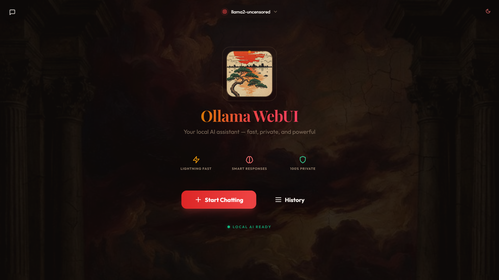
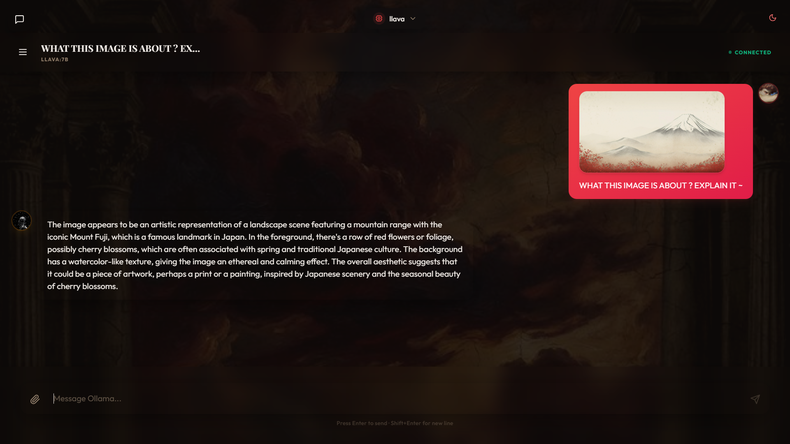
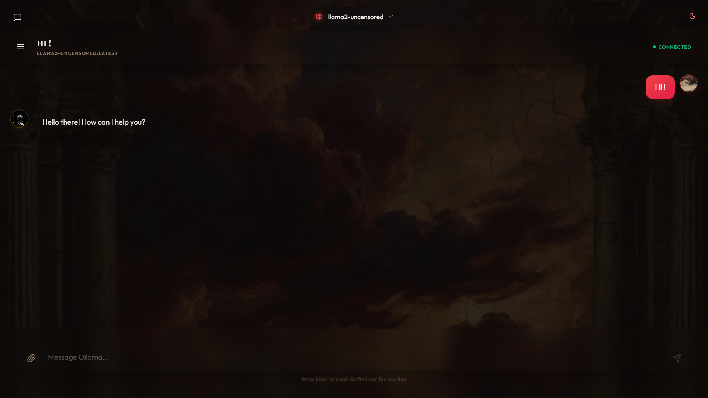

# Ollama WebUI - Renaissance Edition



A clean, high-aesthetic web interface for your local Ollama models. This application features a zero-latency direct connection to your local AI with a focus on premium typography and design.

## Features

| Vision Capabilities | Text Interface |
| :---: | :---: |
|  |  |

## How it Works

This application is a frontend-only client that communicates directly with your local Ollama instance using the Fetch API.

- **Direct Connection**: No backend server is required.
- **Privacy**: All chat history is stored locally in your browser's localStorage.
- **Multimodal Support**: Supports any vision-capable model (like llava, moondream, or bakllava).

## Run with Docker

You can run the pre-built image directly from Docker Hub:

```bash
docker run -p 3000:80 lucifero19/ollama-webui:latest
```

Once running, access the UI at http://localhost:3000.

## Requirements

You must have Ollama installed and running with CORS enabled.

### Enable CORS (Required)

Browsers block direct connections by default. You must set the OLLAMA_ORIGINS environment variable:

- **Windows (PowerShell)**:
  ```powershell
  $env:OLLAMA_ORIGINS="*"; ollama serve
  ```
- **Mac/Linux**:
  ```bash
  OLLAMA_ORIGINS="*" ollama serve
  ```

## Local Development

If you prefer to run from source:

1. Install dependencies: `npm install`
2. Start development server: `npm run dev`
3. Access at: http://localhost:3000

## License
MIT
