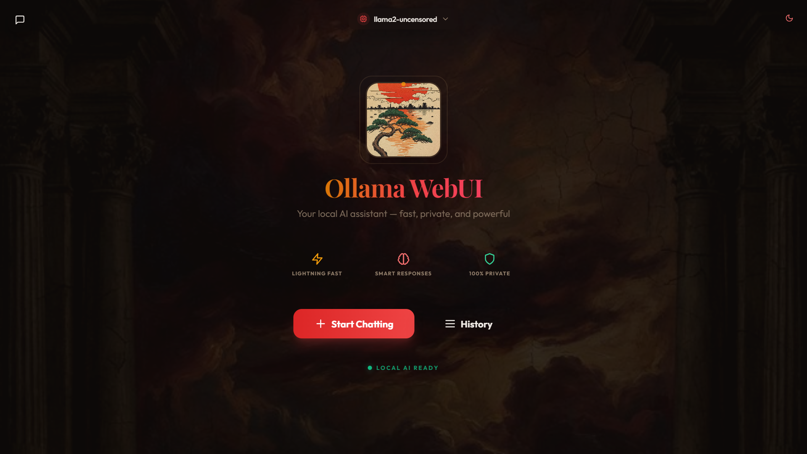
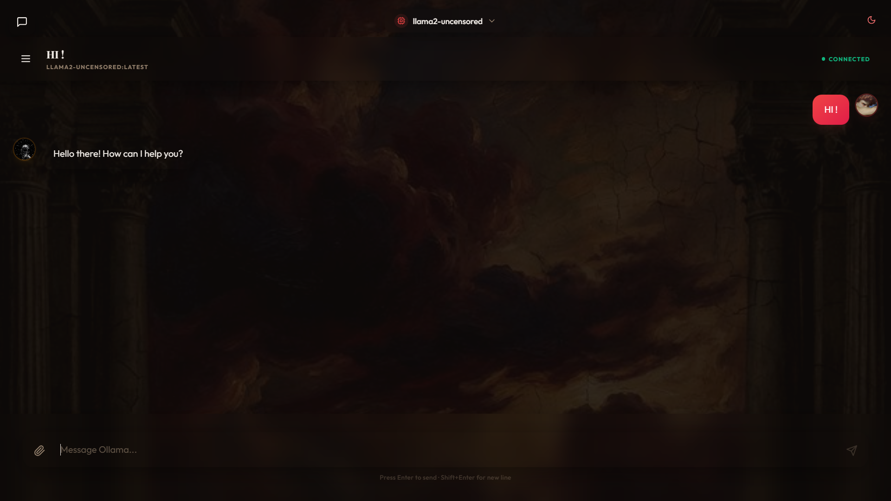

<table>
  <tr>
    <td></td>
    <td><h1>Ollama WebUI — Renaissance Edition</h1></td>
  </tr>
</table>

A beautiful, high-aesthetic web interface for your local Ollama models. Fast, private, and supercharged with advanced features.

## 🖼️ Gallery

### Home Page


### Vision Capabilities


### Chat Interface


## Features

- **Chat with any Ollama model** — Full support for text, vision, and multimodal models.
- **Web Search** — Real-time search powered by DuckDuckGo and **Crawl4AI** (Playwright).
- **Image Search** — Visual results directly in your chat flow.
- **PDF Intelligence** — Upload PDFs and perform instant Q&A (server-side parsing).
- **URL Fetching** — Extract content from any website for AI context.
- **Voice & TTS** — Speech-to-text input and "Read Aloud" voice responses.
- **Prompt Templates** — Pre-defined high-quality prompts to get you started.
- **Premium Animations** — Smooth message slide-ins, pulsing effects, shimmer loading, and warm glow.
- **Auto-Rename Chat** — Double-click the chat title to rename it instantly.
- **Drag-and-Drop** — Drop images, PDFs, CSVs, or text files directly into the chat.
- **Scroll-to-Bottom** — Floating button appears on scroll up for quick navigation.
- **Export Chat** — Download your conversation history as a Markdown file.
- **Real-time Metrics** — View tokens per second (t/s) during generation.
- **Keyboard Shortcuts** — `Ctrl+Shift+N` (New Chat), `Ctrl+B` (Sidebar), `Esc` (Stop).
- **100% Private** — Runs entirely on your local machine.

##  Run with Docker (One Command — Any OS)

**Prerequisites:** Install [Docker Desktop](https://www.docker.com/products/docker-desktop/) for your OS (Windows, Mac, or Linux).

### Quick Start

```bash
# Download docker-compose.yml and start everything
curl -O https://raw.githubusercontent.com/PRATIK-4751/OllamaWebUI/main/docker-compose.yml
docker compose up -d
```

Open **[http://localhost:3000](http://localhost:3000)** and you're done!

> Both frontend and backend images are automatically downloaded from Docker Hub.

### Update to Latest Version

```bash
docker compose pull
docker compose up -d
```

### Stop & Clean Up

```bash
docker compose down
```

##  Requirements

**Ollama** must be running with CORS enabled:

```powershell
# Windows
$env:OLLAMA_ORIGINS="*"; ollama serve

# Mac / Linux
OLLAMA_ORIGINS="*" ollama serve
```

##  Local Development

```bash
# Install & Run Frontend
npm install
npm run dev

# Install & Run Backend (in /backend)
pip install -r requirements.txt
playwright install --with-deps chromium
uvicorn main:app --reload --port 8000
```

